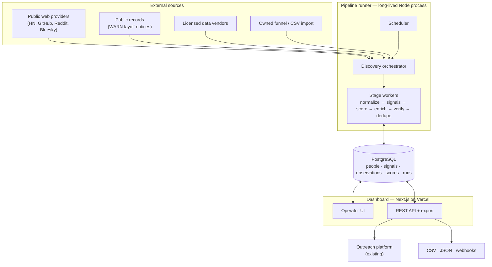
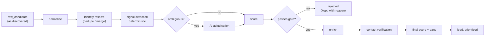

# Architecture — Job-Seeker Lead Intelligence Engine

Status: **proposal, awaiting review.** No implementation has started.

---

## 1. What this system is

It produces a daily, ranked list of people who have **credible, dated, attributable evidence**
that they are looking for work and who are commercially suitable for reverse-recruiting services.

The distinction that drives every decision below: a row in the output is not a profile, it is a
**claim with evidence attached**. "This person is job-seeking" is an assertion the system must be
able to defend — with the text that said so, where it was published, when, and how confident the
classifier was. Anything that cannot carry that evidence does not belong in the output.

Two consequences fall out immediately:

- **Evidence is a first-class entity**, not a column. Signals are rows, with sources and timestamps.
- **Scores are derived, never stored as truth.** Any score can be recomputed from its inputs, and
  every score records which version of the rules produced it.

## 2. Where this sits relative to the existing codebase

This repository currently holds a LinkedIn outreach operations platform: campaigns, a queue, a
supervised browser worker, and a safety architecture built around never sending a duplicate
invitation.

The new engine is a **separate pipeline that feeds it**, not a replacement. The boundary:

| Concern | Owner |
| --- | --- |
| Finding and qualifying people | Lead Intelligence Engine (new) |
| Deciding who to contact, when, and at what rate | Outreach platform (exists) |
| Actually sending anything | Outreach worker (exists) |

Three existing components are load-bearing for the new engine and should be reused rather than
rewritten, because they encode correctness that took tests to establish:

- `src/lib/linkedin-url.ts` — canonical profile identity. 49 unit tests. This is the spine of
  deduplication; a second implementation in another language is a second set of edge cases.
- `src/lib/csv.ts` — shape-agnostic CSV reading, used by the import discovery provider.
- `src/lib/icp.ts` — the explainable rule-scoring pattern (score + reasons + version). Client-fit
  scoring generalises it rather than replacing it.

Also reusable as a *pattern*, not code: the append-only activity log enforced by a database
trigger. Provenance needs the same guarantee.

## 3. Stack recommendation — and where it disagrees with the brief

The brief proposes Python/FastAPI/SQLAlchemy with Celery and Redis. **I recommend TypeScript
end-to-end on PostgreSQL, with the job queue in Postgres rather than Redis.** The full argument
is in [`adr/0001-language-and-runtime.md`](./adr/0001-language-and-runtime.md) and
[`adr/0002-queue-substrate.md`](./adr/0002-queue-substrate.md); the summary:

| Layer | Brief proposes | Recommended | Why |
| --- | --- | --- | --- |
| Pipeline language | Python | TypeScript (Node 20+) | Identity/dedup logic already exists and is tested here; one language means the signal taxonomy and scoring config have one definition, not a Pydantic copy and a TS copy kept in sync by hand |
| API | FastAPI | Next.js route handlers + server actions | Dashboard and API are one deployment that already exists and is live |
| ORM | SQLAlchemy | Prisma 7 | Already in use, with migrations and a verification script that asserts constraints exist in the live database |
| Queue | Celery + Redis | `pg-boss` on PostgreSQL | At 2,000 records/day (~0.02/s) this is not a throughput problem. Redis adds a second stateful service and a second failure mode for no capability gained |
| Database | PostgreSQL | PostgreSQL | Agreed, unreservedly |
| Frontend | Next.js + TS + Tailwind + shadcn/ui | Same | Already built |

**Where Python would genuinely win**, and the condition under which I would change this
recommendation: if the signal engine moves to locally-hosted transformer models, embeddings, or
fine-tuning. Calling a hosted LLM over HTTP needs no Python. Running one does.

The architecture keeps that door open: the scoring and signal engines are defined as services with
a versioned JSON contract, so a Python implementation can replace the TypeScript one behind the
same interface without touching the dashboard, the database, or the pipeline runner. **This is a
decision to make now, cheaply, rather than later, expensively — please rule on ADR-0001 before
Phase 2 begins.**

## 4. Runtime topology



Two processes, deliberately:

**Dashboard** (Vercel). Request-scoped. Reads the database, drives the UI, serves the export API.
It never runs a pipeline stage — serverless functions have wall-clock limits and no durable state.

**Pipeline runner** (a long-lived Node process on Railway/Fly/a VPS). Owns discovery, all stage
processing, and the scheduler. Runs continuously, holds database credentials, has no browser.

> Note a deliberate difference from the existing outreach worker, which holds *no* database
> credentials on purpose. That rule exists because the outreach worker drives a signed-in browser
> and is the component most exposed to a hostile page. The pipeline runner has no browser and no
> session, so the same constraint would buy nothing and cost a great deal of indirection.

## 5. The pipeline

Each candidate flows through the stages **independently**, not in synchronised batches. A batch
barrier means one slow provider stalls every record behind it, and one poisoned record can fail a
whole batch. Per-record flow isolates both.



Every stage obeys four rules:

1. **Idempotent.** Re-running a stage on the same record produces the same result and no duplicate
   rows. Stage output is keyed, not appended blindly.
2. **Resumable.** State lives in the database between stages, never in process memory. Killing the
   runner mid-pipeline loses at most the records currently in flight, which are retried.
3. **Non-destructive.** A rejected candidate is *marked* rejected with a reason, never deleted.
   Rejections are the primary tuning signal for the scoring engine; discarding them destroys the
   only evidence that the filters are calibrated.
4. **Attributable.** Every field a stage writes records where it came from.

Identity resolution runs *before* expensive work. Deduplicating after enrichment means paying for
the same person twice.

## 6. Modules and their contracts

```
src/engine/
  discovery/
    provider.ts          # DiscoveryProvider interface — the plug point
    orchestrator.ts      # scheduling, budgets, rate limits, provider health
    providers/           # one file per source; no cross-imports between them
  normalization/         # raw record -> canonical candidate shape
  identity/
    keys.ts              # key derivation: url, email, name+company, domain+name
    resolve.ts           # match or create
    merge.ts             # merge two people, reversibly
  signals/
    taxonomy.ts          # signal types, intent tiers — data, not code
    detectors/           # deterministic pattern detectors
    adjudicator.ts       # AI, only for the ambiguous middle
  scoring/
    intent.ts fit.ts freshness.ts contactability.ts
    final.ts             # weighted combination + banding
    profile.ts           # campaign-configurable weights and thresholds
  enrichment/            # additional attributes, each with provenance
  verification/          # email deliverability, provider-abstracted
  provenance/            # field observations, append-only
  lifecycle/             # state machine + transition log
  export/                # CSV, JSON, webhook
  observability/         # run records, counters, timings
src/pipeline/
  stages.ts              # stage registry
  runner.ts              # process entry point
  scheduler.ts
```

**Contract between modules:** typed functions over versioned DTOs, within one runtime. Not HTTP —
network hops between stages buy nothing here and cost latency, failure modes, and debuggability.
The exception is the **signal + scoring engine**, which is defined behind a narrow interface
(`ScoringEngine.score(candidate, profile) -> ScoreResult`) precisely so it can later be moved
out-of-process, in another language, without disturbing anything else.

**Provider contract** — the plug point the brief asks for:

```ts
interface DiscoveryProvider {
  readonly id: string;
  readonly kind: 'public_web' | 'public_record' | 'licensed_vendor' | 'import' | 'owned';
  /** Declared, auditable basis for using this source. */
  readonly compliance: ComplianceDeclaration;
  health(): Promise<ProviderHealth>;
  search(criteria: DiscoveryCriteria, budget: Budget): AsyncIterable<RawRecord>;
  normalize(raw: RawRecord): NormalizedCandidate | NormalizationFailure;
}
```

Nothing downstream of `normalize` may branch on `provider.id`. Source-specific behaviour lives in
the provider or it does not exist. `compliance` being a required field is deliberate: a provider
that cannot state its legal basis cannot be registered.

## 7. Scheduling

Pipeline runs are **records, not cron side-effects**. A `pipeline_run` row exists before work
starts, accumulates counters as it goes, and ends in a terminal state. This makes "what happened at
08:00 yesterday" answerable, which a bare cron job does not.

- Schedules are rows (`schedule` table), editable in the dashboard, not code constants.
- Supported: daily, hourly, per-campaign cadence, manual trigger, pause/resume.
- The scheduler holds an **advisory lock**, so two runner instances cannot start the same run —
  the same single-writer discipline the outreach worker already uses.
- A run that dies mid-flight is detected by heartbeat staleness and its in-flight records are
  requeued, not silently abandoned.

Concurrency is bounded per provider, not globally, so a slow vendor cannot starve fast sources.

## 8. Testing strategy

| Layer | What it proves | Needs a database |
| --- | --- | --- |
| Unit — scoring | A given signal set produces a given score and reasons | No |
| Unit — signal detection | The taxonomy fires on the right text and, more importantly, does not fire on the wrong text | No |
| Unit — identity keys | Key derivation is stable and collision-free | No |
| Integration — dedup/merge | Two discoveries of one person converge to one row with two sources | Yes |
| Integration — provenance | Every written field has an observation; the log rejects UPDATE | Yes |
| Integration — lifecycle | Illegal state transitions are refused | Yes |
| Provider — contract | Each provider satisfies the interface against recorded fixtures | No (fixtures) |
| API | Auth, rate limits, export shape | Yes |

**The synthetic corpus is the centrepiece**, per the brief. It must contain, with expected
classifications committed alongside: genuine seekers at each intent tier; recruiters advertising
roles; hiring managers; people who *just started* a job (the most dangerous false positive, because
"excited to announce" pattern-matches to career-change language); ambiguous statements; stale
signals; the same person duplicated across sources with differing spellings.

Scoring changes are evaluated against this corpus as a **regression suite with precision/recall
reported**, not a pass/fail. A tuning change that raises recall and quietly destroys precision must
be visible as a number before it ships.

## 9. Observability

Every run writes: provider yields, rejection reasons by category, stage timings, AI call count and
cost, dedupe merge count, enrichment and verification hit rates, error detail.

The dashboard surfaces last successful run, last failure, per-provider health, candidates/hour,
qualification rate, duplicate rate, and enrichment success rate.

**Errors are never swallowed.** A provider that fails marks the run degraded and names itself. A
run that produced 40 leads instead of 600 reports 40 and why — the brief is explicit on this, and
it is the difference between a tool you can trust and a number you have to go verify by hand.

## 10. Principal risks

Ordered by how much they threaten the project, not by likelihood.

### R1 — Discovery supply is the binding constraint (severe)

Everything downstream is tractable engineering. Finding 1,000–2,000 lawfully-sourced raw candidates
per day, with *dated job-seeking evidence and a route to contact*, is the part that may not be
achievable at the stated volume. See [`DISCOVERY.md`](./DISCOVERY.md) for a source-by-source yield
estimate. Short version: public web sources plausibly sustain tens per day, not hundreds; reaching
500–600/day almost certainly requires licensed vendor data, an owned inbound funnel, or both.

This should be settled before Phase 2. Building a 600/day pipeline over a 60/day supply is the most
expensive mistake available here.

### R2 — Legal basis for processing (severe)

Job-seeking status is sensitive by context: it correlates with redundancy and financial pressure.
GDPR applies to EU/UK subjects regardless of where the data was found, and "it was public" is not a
lawful basis on its own. This needs a documented legitimate-interest assessment, a retention
policy, a working erasure path, and a suppression list that survives re-discovery.
See [`SECURITY.md`](./SECURITY.md).

### R3 — Score bands as specified will be nearly empty (moderate, and a real defect)

With weights 50/30/10/10 and sub-scores capped at 100, reaching the HOT band (90+) requires a
near-perfect result in every dimension simultaneously. In practice HOT will be rare to the point of
uselessness and the operator will lose faith in the banding. Bands must be **calibrated against the
observed distribution**, not fixed in advance. Detail and proposed fix in [`SCORING.md`](./SCORING.md).

### R4 — Contactability is a gate wearing the costume of a weight (moderate)

A lead with no verified contact route cannot be worked, whatever it scores. At 10% weight it can
score 88 and be entirely unactionable. Recommend keeping the weight *and* gating
`READY_FOR_OUTREACH` on a verified contact route.

### R5 — Freshness decay makes scores perishable (moderate)

A score computed once is wrong by the next morning. Scores must be recomputed on a schedule, which
means score writes must be cheap and versioned — an argument for storing score *inputs* durably and
treating the score itself as a materialised view.

### R6 — AI cost and latency scale with raw volume, not qualified volume (low, if gated)

Adjudicating 2,000 candidates/day with an LLM is affordable; doing it on every field of every
candidate is not. The design gates AI behind deterministic pre-filtering and confines it to the
ambiguous middle. Cost per qualified lead must be a measured number in Phase 2, not an assumption.

### R7 — Vendor dependency and concentration (low now, structural later)

If licensed data becomes the primary supply, the business inherits that vendor's pricing, coverage
and terms. The provider abstraction limits the blast radius to one file, which is the point of it.

---

## Companion documents

- [`DATABASE.md`](./DATABASE.md) — schema, identity model, provenance, lifecycle
- [`DISCOVERY.md`](./DISCOVERY.md) — provider abstraction, source inventory, realistic yield
- [`SCORING.md`](./SCORING.md) — taxonomy, decay, weights, banding, explainability, AI boundary
- [`ROADMAP.md`](./ROADMAP.md) — MVP sequence and complexity estimates
- [`SECURITY.md`](./SECURITY.md) — secrets, auth, privacy law, suppression, what will not be built
- [`adr/`](./adr) — technical decision records
