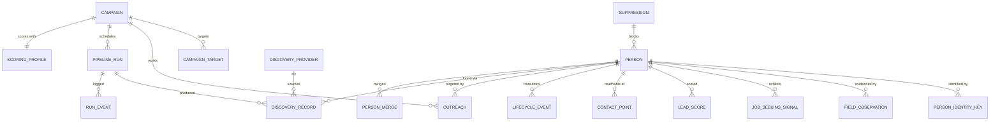
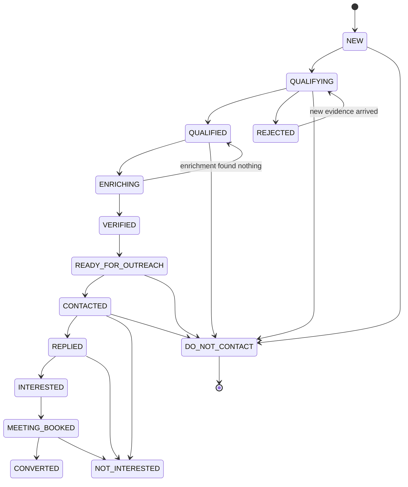

# Database Design

Status: **proposal, awaiting review.** PostgreSQL only.

The schema is built around three commitments that the brief states and that turn out to have real
structural consequences:

1. **Never fabricate missing data.** Therefore every externally sourced value is stored as an
   *observation* with a source, not as a bare column. The person row holds the resolved current
   best value; the observations hold the evidence for it.
2. **One person, many sources.** Therefore identity is a set of keys pointing at a person, not a
   unique column on the person, and merging is a first-class reversible operation.
3. **Every score is explainable.** Therefore scores are versioned rows with their contributing
   evidence, not columns that get overwritten.

---

## 1. Entity overview



---

## 2. Identity and deduplication

### The model

A person is not identified by a column. They are identified by any of several **keys**, each of
which points at exactly one person:

```
person_identity_key
  id
  person_id        FK -> person
  key_type         LINKEDIN_URL | EMAIL | NAME_COMPANY | NAME_DOMAIN | VENDOR_ID | HANDLE
  key_value        text, already normalised
  confidence       numeric  -- fuzzy keys are not certainties
  first_seen_at
  source           text

  UNIQUE (key_type, key_value)          -- the whole dedup guarantee, in one index
  INDEX (person_id)
```

Resolution on discovery of a candidate:

1. Derive every key the candidate supports.
2. Look them up. **No match** → create a person. **One person matched** → attach new keys and
   observations to them. **Two or more distinct people matched** → the sources disagree about
   identity; queue a `merge_candidate` for review rather than guessing.
3. Never merge automatically on a fuzzy key alone.

Key derivation rules, strongest first:

| Key type | Derivation | Confidence |
| --- | --- | --- |
| `LINKEDIN_URL` | `normalizeLinkedInUrl()` — existing, tested | Exact |
| `EMAIL` | lower-cased, gmail dots/plus-tags folded | Exact |
| `VENDOR_ID` | `vendor:id` | Exact within that vendor |
| `HANDLE` | `platform:handle` (github, reddit, bluesky) | Exact within that platform |
| `NAME_DOMAIN` | normalised name + employer email domain | High |
| `NAME_COMPANY` | normalised name + normalised company | Medium — **suggests, never merges** |

Fuzzy name matching (the brief's item 4) runs as a *candidate generator* feeding human-reviewable
`merge_candidate` rows. It is deliberately not allowed to merge on its own: a wrong merge silently
fuses two real people and is close to unrecoverable once outreach has touched the result.

### Merging

```
person_merge
  id
  surviving_person_id
  merged_person_id
  reason            text
  merged_by         'system' | user id
  key_snapshot      jsonb    -- everything needed to undo
  created_at
```

Merging repoints keys, observations, signals and discovery records at the survivor, then marks the
merged row `MERGED_INTO`. The row is not deleted — a deleted row cannot be un-merged, and cannot
explain why an outreach record points somewhere unexpected.

---

## 3. Person and provenance

```
person
  id
  full_name          text
  first_name         text
  last_name          text
  current_title      text
  current_company    text
  previous_title     text
  previous_company   text
  location           text
  country            text
  industry           text
  years_experience   int
  linkedin_url       text          -- canonical; also a key
  personal_website   text
  status             lifecycle_state
  merged_into_id     FK -> person  -- null unless merged
  first_seen_at      timestamptz
  last_seen_at       timestamptz
  created_at / updated_at

  INDEX (status), (last_seen_at), (country), (industry)
```

Every non-derived column above is a **resolved value**, and the evidence for it lives here:

```
field_observation
  id
  person_id
  field              text        -- 'current_title', 'location', ...
  value              text
  source             text        -- provider id
  source_url         text
  source_kind        public_web | public_record | licensed_vendor | import | owned | ai_inference
  confidence         numeric
  observed_at        timestamptz -- when we saw it
  published_at       timestamptz -- when the source published it, when known
  verified_at        timestamptz
  model              text        -- AI-derived only
  prompt_version     text        -- AI-derived only

  INDEX (person_id, field, observed_at DESC)
```

**Append-only, enforced by a database trigger**, exactly as `activity_logs` already is in this
repository. Convention is not enough: the value of provenance is that it cannot be quietly edited
after the fact.

Resolution policy when observations conflict: highest source-kind precedence wins
(`owned` > `public_record` > `licensed_vendor` > `public_web` > `ai_inference`), ties broken by
most recent `published_at`. The policy is a pure function and unit-tested, so "why does it say
Acme?" is always answerable.

`source_kind = 'ai_inference'` is the mechanism behind "never let the AI invent employers".
An AI-derived value is stored as an observation with model and prompt version attached, and it
loses to any human-sourced observation. It can never be the *only* evidence for a contact field.

---

## 4. Job-seeking signals

```
job_seeking_signal
  id
  person_id
  signal_type       enum (see SCORING.md taxonomy)
  intent_tier       HIGH | MEDIUM | LOW | NEGATIVE
  signal_text       text        -- the actual words, verbatim
  signal_source     text
  signal_url        text
  detected_at       timestamptz -- when the system classified it
  published_at      timestamptz -- when the human published it  <-- decay uses THIS
  confidence        numeric
  classifier        'rule' | 'ai'
  classifier_version text
  metadata          jsonb
  superseded_by     FK -> job_seeking_signal

  UNIQUE (person_id, signal_type, signal_url, published_at)   -- re-discovery is not a new signal
  INDEX (person_id, published_at DESC), (signal_type), (published_at DESC)
```

Three points that matter more than they look:

- **`published_at` drives decay, not `detected_at`.** Discovering a six-month-old post today does
  not make it fresh. Conflating these would systematically overvalue stale evidence — the single
  most likely way this product quietly starts producing garbage.
- **`published_at` is nullable and that is not a footnote.** Many sources do not give a reliable
  publication date. A signal with no date cannot be decayed honestly; policy is to treat it as
  `LOW` tier with a confidence penalty, never to assume "recent".
- **Negative signals are stored as signals**, not as absence. "Started a new role last week" is
  evidence, and it must appear in the explanation of why someone was rejected.

---

## 5. Contact points

```
contact_point
  id
  person_id
  kind              EMAIL | PHONE | PROFILE | WEBSITE
  value             text
  status            UNVERIFIED | VALID | RISKY | INVALID | CATCH_ALL | UNKNOWN
  verified_at
  verifier          text
  source / source_url / confidence

  UNIQUE (person_id, kind, value)
```

Separate from `person` because a person legitimately has several, each with its own verification
state and provenance. Contactability scoring reads from here.

---

## 6. Scores

```
lead_score
  id
  person_id
  campaign_id                 -- fit depends on who is asking
  intent_score        int 0-100
  client_fit_score    int 0-100
  freshness_score     int 0-100
  contactability_score int 0-100
  overall_score       int 0-100
  band                HOT | HIGH | MEDIUM | LOW | REJECT
  score_version       text     -- rules version
  profile_version     text     -- weights version
  explanation         jsonb    -- contributing + negative factors, each with points and evidence id
  scored_at

  UNIQUE (person_id, campaign_id, score_version, profile_version, scored_at)
  INDEX (campaign_id, overall_score DESC), (campaign_id, band, scored_at DESC)
```

Scores are **append-only history**, with the current score being the latest row. This costs storage
and buys two things worth more than the storage: you can prove what the score was on the day a
lead was worked, and you can A/B two scoring versions over the same population without destroying
either.

Because freshness decays daily, a nightly rescore job writes new rows for active leads. Score
computation is pure and deterministic, so this is cheap and needs no external calls.

---

## 7. Campaign and scoring profile

```
campaign
  id, name, description, status
  target_locations      text[]
  target_titles         text[]
  target_industries     text[]
  target_experience     int4range
  target_salary         int4range
  target_company_types  text[]
  include_keywords      text[]
  exclude_keywords      text[]
  required_signal_types text[]
  daily_target          int         -- a target, never a quota to fill
  scoring_profile_id    FK
  created_at / updated_at

scoring_profile
  id, name, version
  weights          jsonb   -- {intent, clientFit, freshness, contactability}
  decay_curve      jsonb   -- [{maxAgeDays, multiplier}, ...]
  signal_points    jsonb   -- per signal type
  fit_rules        jsonb   -- generalisation of the existing ICP rule shape
  band_thresholds  jsonb   -- fixed or percentile-calibrated
  created_at
```

No campaign criterion is a code constant. A new ICP is a row.

Scoring profiles are **immutable once used**: editing creates a new version. Otherwise a score row
citing `profile_version` cannot be reproduced, which defeats the point of recording it.

---

## 8. Lifecycle

```
lifecycle_event
  id, person_id, campaign_id
  from_state, to_state
  reason text
  actor  'system' | user id
  created_at
```



`DO_NOT_CONTACT` is reachable from every state and is **terminal and absorbing**: nothing leaves it,
including re-discovery through a different source. Enforced by a database constraint, not
application code, for the same reason the outreach platform enforces its duplicate protection in
the database — application checks are racy and get refactored away.

`REJECTED → QUALIFYING` exists because rejection is about today's evidence. Someone rejected in
March who posts "I've been laid off" in June is a new lead, and the system must be able to say so.

---

## 9. Discovery, runs and suppression

```
discovery_provider     id, kind, enabled, config jsonb, compliance jsonb, health jsonb
discovery_record       id, run_id, provider_id, person_id, external_id, raw jsonb,
                       normalized jsonb, outcome, rejection_reason, created_at
                       UNIQUE (provider_id, external_id)      -- provider-level idempotency
pipeline_run           id, campaign_id, trigger, started_at, finished_at, state,
                       counters jsonb, degraded_reason text
run_event              id, run_id, stage, level, message, data jsonb, created_at
suppression            id, key_type, key_value, reason, source, created_at
                       UNIQUE (key_type, key_value)
```

`raw` is kept verbatim. When a normalisation rule turns out to be wrong six weeks in, the original
payload is the only thing that lets past records be reprocessed rather than rediscovered.

`suppression` is checked at **identity resolution**, before scoring and before any spend, so a
suppressed person costs nothing and — importantly — cannot reappear via a different source.

---

## 10. Migration approach

Additive, in the existing Prisma project, on the existing PostgreSQL database. The outreach
platform's tables are untouched; `person.linkedin_url` is the join to `leads.linkedinUrl` when a
qualified lead is promoted into an outreach campaign.

Constraints that must exist **in the database**, not in code, and be asserted by an extended
`npm run db:verify`:

- `UNIQUE (key_type, key_value)` on `person_identity_key`
- append-only triggers on `field_observation` and `lifecycle_event`
- `DO_NOT_CONTACT` as an absorbing state
- suppression uniqueness
- `UNIQUE (provider_id, external_id)` on `discovery_record`

The existing verification script proves safety properties against the live database rather than
asserting them in a README. The same discipline should extend to these.
